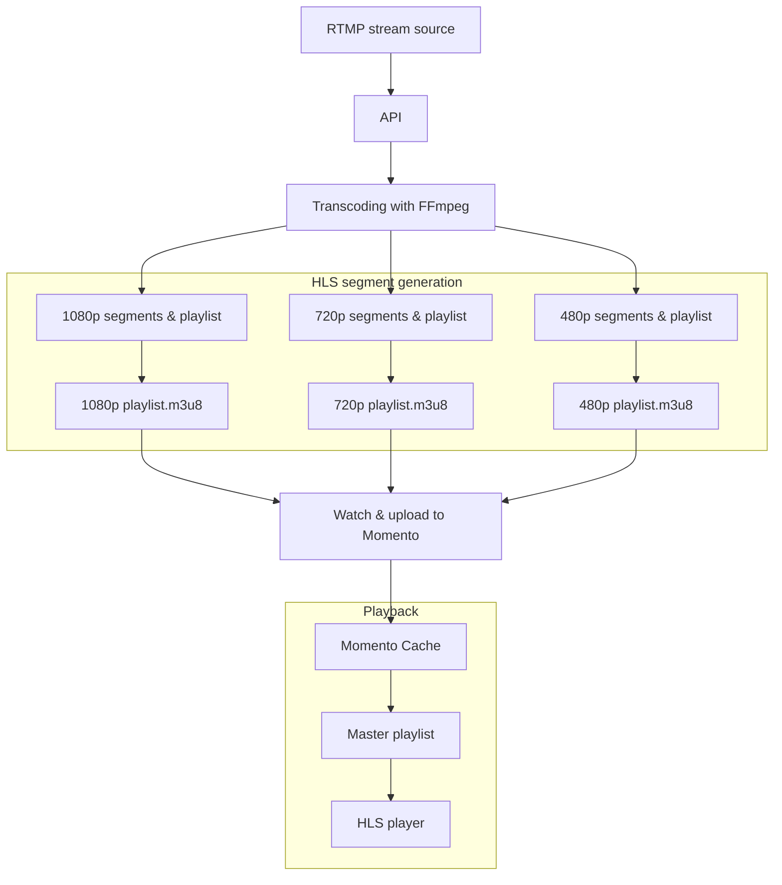

# RTMP transcoding and storage with FFmpeg and Momento

This project is a Node.js application using Express, FFmpeg, and the Momento SDK to ingest live RTMP streams, transcode them to multiple resolutions, and store the resulting HLS segments and playlists in Momento Cache. The stored files are then accessible to HLS-compatible media players for real-time streaming.

## Prerequisites

- **FFmpeg**: Ensure that FFmpeg is installed on your system, and the `FFMPEG_PATH` environment variable is set to its executable location.
- **Momento Cache**: [Create a cache](https://console.gomomento.com/cache) in Momento to store the transcoded segments and playlist files. You will also need [Momento SDK credentials](https://console.gomomento.com/api-keys).
- **Node.js and npm**: Node.js (v20 or later) and npm should be installed on your system.

### Environment variables

As written, the app requires two environment variables:

* `MOMENTO_API_KEY` - The API key that grants write access to a cache in your Momento account
* `FFMPEG_PATH` - The path to the FFmpeg binary on the machine running the script

### CDN

For a complete end-to-end test, you will need some sort of CDN that fowards your Momento API key to the Momento HTTP API. [Read more](https://docs.momentohq.com/mediastore/streaming/decoding-video#using-a-cdn-with-header-forwarding).

## How it works

The application ingests an RTMP stream, uses FFmpeg to transcode it to multiple HLS streams (in different resolutions and bitrates), and uploads the segments and playlists to Momento Cache for access by HLS players. You can view the full tutorial in the [Momento developer docs](/https://docs.momentohq.com/mediastore/streaming/capture/rtmp).

### What is happening

1. **API setup**:
   - The application sets up an Express server with a `POST` endpoint at `/livestreams`.
   - The endpoint accepts an `rtmpUrl` (the source of the RTMP stream) and `streamName` (a unique name for identifying the stream).
   - When a request is received, the server initiates the transcoding workflow, which includes the `rtmpUrl` and a sanitized `streamName`.

2. **Transcoding with FFmpeg**:
   - FFmpeg processes the RTMP stream, generating three resolutions: **1080p** (5 Mbps), **720p** (3 Mbps), and **480p** (1.5 Mbps).
   - Each resolution outputs segments and a corresponding `.m3u8` playlist.
   - FFmpeg options are set to control segment length, output quality, and file naming conventions. The naming convention includes the `streamName`, resolution, and segment number, ensuring unique file names across resolutions.

3. **Uploading to Momento**:
   - A watcher function monitors each resolution directory for newly generated `.ts` segment files and `.m3u8` playlist files.
   - When new files are detected, they are read and uploaded to Momento Cache using unique keys that incorporate the `streamName` and resolution.
   - Momento Cache is used for storing the files, making them accessible for playback.

4. **Master playlist creation**:
   - The application creates a master playlist file (`.m3u8`) that references each resolution's playlist, allowing media players to select the best resolution based on available bandwidth.
   - The master playlist is stored in Momento Cache under a key that matches the `streamName`, making it easy to locate.

5. **Playback**:
   - The stored master playlist and its associated segments allow for adaptive bitrate streaming, where media players can switch resolutions dynamically.
   - By accessing the master playlist url, an HLS-compatible player can retrieve and play the live stream in real-time.

This setup provides an end-to-end pipeline for live-streaming ingestion, transcoding, and adaptive bitrate playback via HLS, making it ideal for live streaming applications that require scalable and low-latency video delivery.
